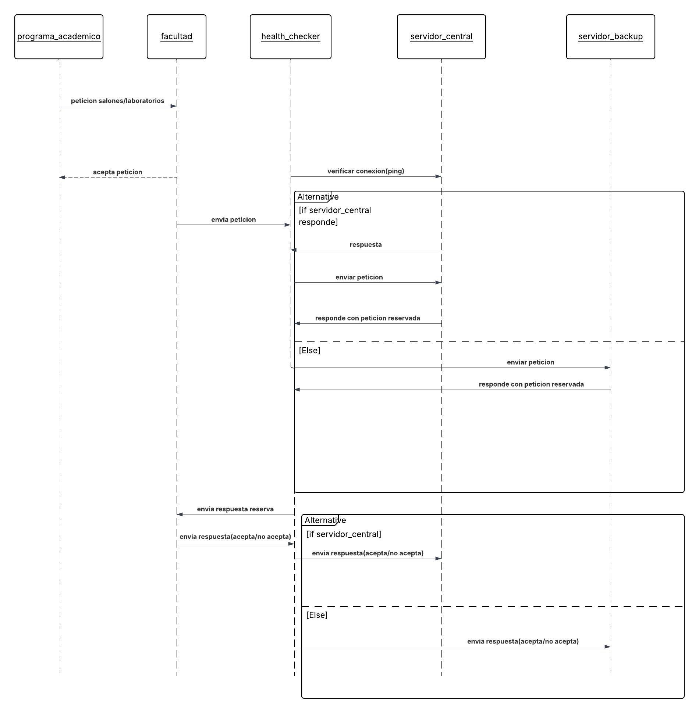
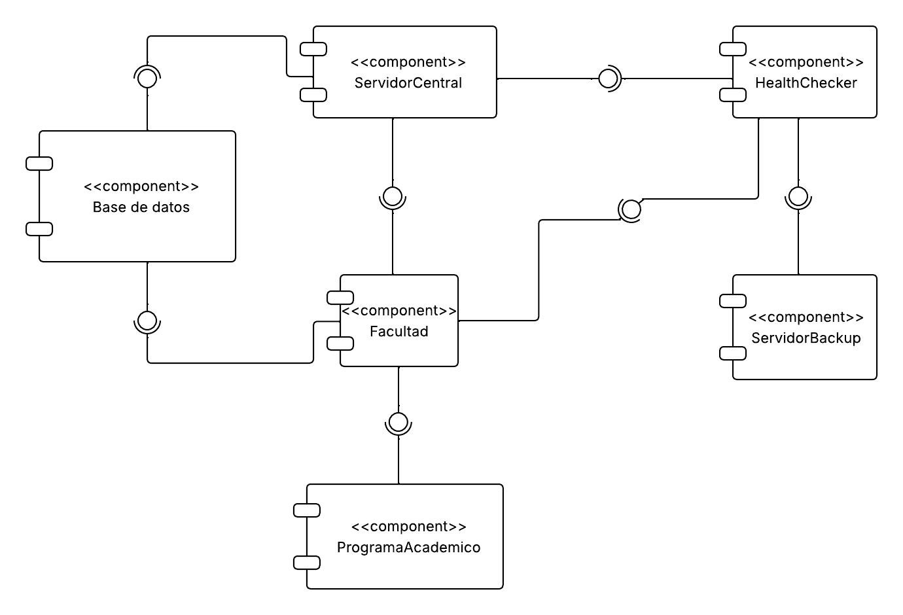

# Proyecto Sistemas Distribuidos

## Índice

- [Integrantes](#integrantes)
- [Descripción del proyecto](#descripción-del-proyecto)
- [Instalación y ejecución](#instalación-y-ejecución)
- [Diagramas del sistema](#digramas-del-sistema)

---

## Integrantes

- Erick Salazar Suarez
- Nicolas Polanco Algarra
- Jorge Sierra Laiton

---

## Descripción del proyecto

Sistema que permite la coordinación y reserva de salas de estudio mediante procesos distribuidos con comunicación síncrona y asíncrona.

---

## Instalación y ejecución

Para instalar las dependencias necesarias, ejecutar:

```bash
pip install pyzmq
```

Para ejecutar cada componente del proyecto, utilizar los siguientes comandos en el directorio correspondiente a la version del proyecto

## request-reply(asincrono)

### Health checker
```bash
python health_checker.py
```

### Servidor central
```bash
python servidor_central.py
```

### Facultad
```bash
python facultad.py -n Ciencias -s 05-2025 -ip-p-s localhost:5555 -puerto-escuchar 5556
```

### Programa académico
```bash
python programa_academico.py -n Matematicas -s 05-2025 -num-s 8 -num-l 3 -ip-p-f localhost:5556
```

### Servidor respaldo
```bash
python servidor_respaldo.py
```
---

## Digramas del Sistema

### Diagrama de clases


---

### Diagrama de despliegue


---

### Diagrama de Secuencia



---

### Diagrama de Componentes

