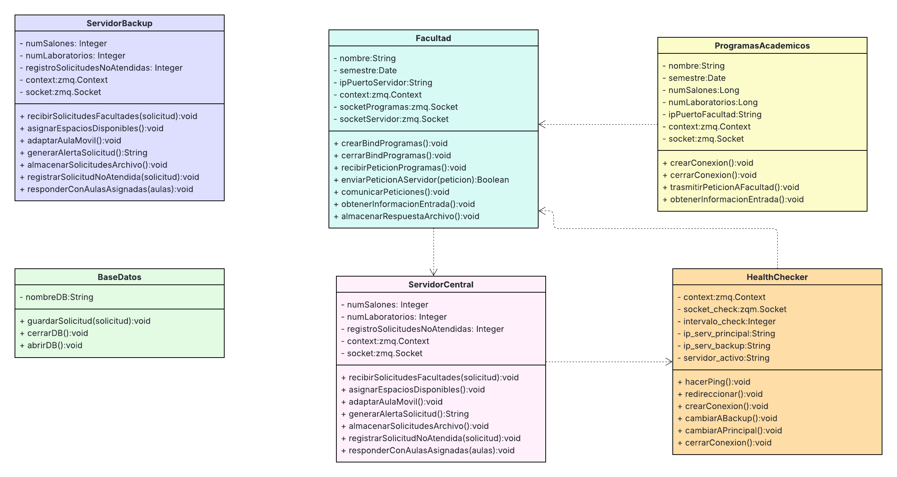
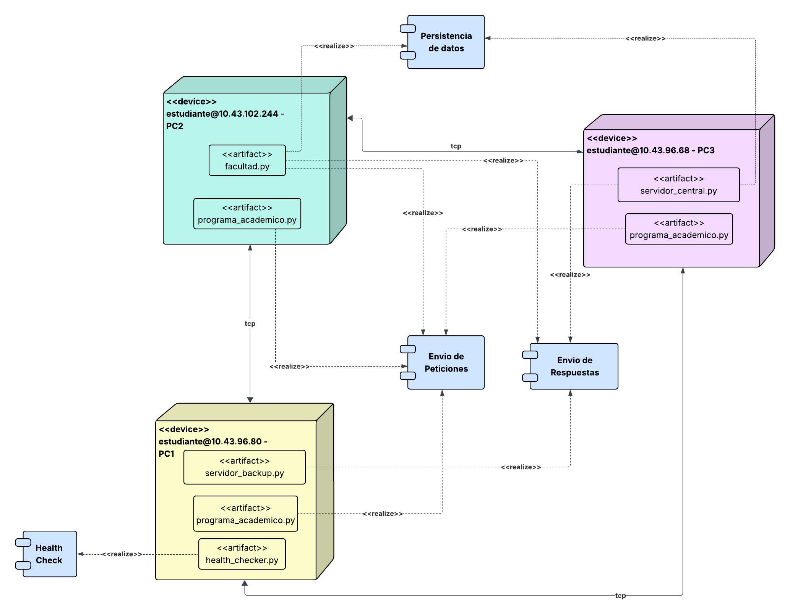

# Proyecto Sistemas Distribuidos

## Índice

- [Integrantes](#integrantes)
- [Descripción del proyecto](#descripción-del-proyecto)
- [Instalación y ejecución](#instalación-y-ejecución)
- [Diagrama de clases](#diagrama-de-clases)
- [Diagrama de despliegue](#diagrama-de-despliegue)

---

## Integrantes

- Erick Salazar Suarez
- Nicolas Polanco Algarra
- Jorge Sierra Laiton

---

## Descripción del proyecto

Sistema que permite la coordinación y reserva de salas de estudio mediante procesos distribuidos con comunicación síncrona y asíncrona.

---

## Instalación y ejecución

Para instalar las dependencias necesarias, ejecutar:

```bash
pip install pyzmq
```

Para ejecutar cada componente del proyecto, utilizar los siguientes comandos en la raíz del proyecto:

### Programa académico
```bash
python src/rep-req-asinc/programa_academico.py
```
### Facultad
```bash
python src/rep-req-asinc/facultad.py
```
### Servidor central
```bash
python src/rep-req-asinc/servidor_central.py
```
### Servidor respaldo
```bash
python src/rep-req-asinc/servidor_respaldo.py
```
### Health checker
```bash
python src/rep-req-asinc/health_checker.py
```

---

## Diagrama de clases



---

## Diagrama de despliegue

